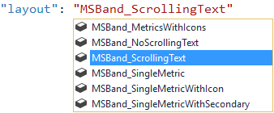
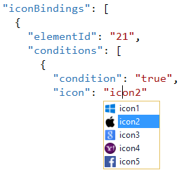
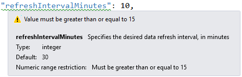
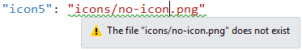
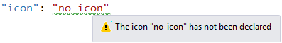

## Microsoft Band Tools for Visual Studio

A Visual Studio extension that provides additional tooling
for writing Web Tiles for the Microsoft Band.

Download the extension at the
[VS Gallery](https://visualstudiogallery.msdn.microsoft.com/b3f06ea7-06ad-4f4d-83f1-27be49bf2987)
or get the
[nightly build](http://vsixgallery.com/extension/74cd5721-9cfd-4183-b1c9-b051f1b59503/)

## Features

1. Intellisense
  - Based on the schema
  - For custom icons
2. Valdation
  - Against the schema
  - Icon file paths
  - Undeclared icons

## Intellisense

### Schema based
You get full Intellisense for the manifest.json file due
to the automatic schema resolver in this extension.

### Custom icons
Get customized Intellisense for the icons you have already
registered.

This makes it really easy to see what's going on.

## Validation

### Schema validation
Validation helps catch common mistakes and typos.

### Icon file paths
Make sure the icon files you are referencing actually
exist.

### Undeclared icons
Check that all referenced icons have been declared
before use.

